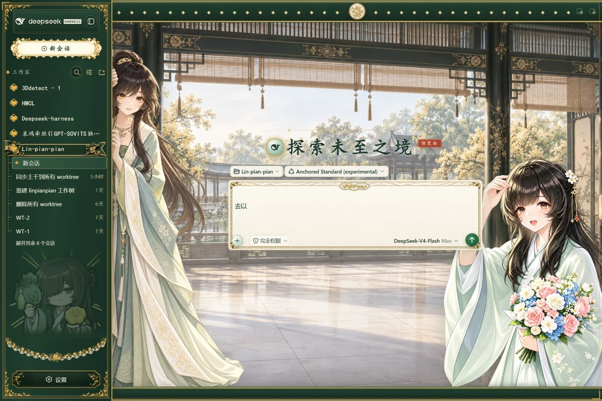
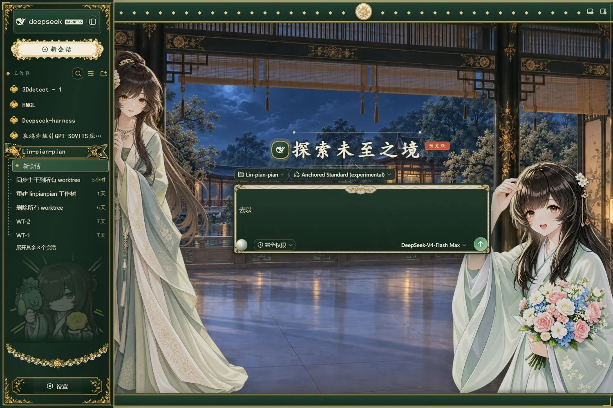

# 林翩翩 · 松烟鎏金书斋

[English](./README.md)

面向 DeepSeek Harness Web UI 的独立显示层皮肤。0.2.0 将旧发布版更新为当前的
临水藏书阁昼夜场景、精修双人物、薄绢刺绣输入框和桂枝装裱侧栏，不修改后端、模型或工具行为。




## 安装与更新

**本仓库可以直接作为 DeepSeek Harness 的 Web 插件安装。** 当前包名为
`dsh-linpianpian-skin`，版本为 `0.2.0`。仓库已包含 `lib/index.js`、
`lib/client.js`、`cordis.patch.yml` 和内嵌美术资源；普通安装无需编译、Python、
重新生图或烘焙，也不执行 `prepare`。它不是独立应用，需要由 Harness 加载。

### 1. 准备环境与目标 profile

需要 Node.js `^22.19.0 || >=24.0.0` 和 pnpm；从 GitHub 安装还需要 Git。
以下命令适用于终端，Windows 建议使用 PowerShell：

```sh
node --version
npm install --global pnpm
pnpm --version
npx @deepseek-ai/dsh --version
```

本文统一安装到 `web` profile，默认位置是 `~/.dsh/profiles/web`，
设置了 `DSH_HOME` 时则位于该目录的 `profiles/web` 下。安装和启动必须使用同一个
profile、同一个 `DSH_HOME`。已有全局 `dsh` 命令时，可用它替换 `npx @deepseek-ai/dsh`。
宿主安装与启动说明见 [DeepSeek Harness 官方仓库](https://github.com/deepseek-ai/deepseek-harness)。

先在原运行终端按 `Ctrl+C` 停止 Harness，再安装或更新。
发布包与开发包 `@dsh-external/dsh-client-ui-skin-linpianpian` 共用 wiring id；
**只有已装过开发包时**，先执行迁移：

```sh
npx @deepseek-ai/dsh plugin --profile web remove @dsh-external/dsh-client-ui-skin-linpianpian
```

### 2. 选择一种安装方式

**方式 A：直接安装当前本地目录（Windows PowerShell）。**

```powershell
npx @deepseek-ai/dsh plugin --profile web add 'D:\D盘工作台\dsh-aihong\dsh-linpianpian-skin'
```

路径应指向包含 `package.json` 的仓库根目录；其他电脑请替换为实际**绝对路径**。
pnpm 11 会把这种目录安装记录为 `link:`，因此安装后不要移动或删除该目录。
只使用仓库已有构建产物时，不必先运行 `pnpm install` 或 `pnpm build`；
修改源码后才需要按下方开发步骤重新构建。

**方式 B：直接从 GitHub 安装。**

```sh
npx @deepseek-ai/dsh plugin --profile web add github:AiNaer/dsh-linpianpian-skin#master
```

`master` 是当前默认分支。需要固定版本时，把 `master` 替换为实际存在的 tag 或
完整 commit SHA；不要把包版本号当作已经发布的 tag。此方式不要求先克隆仓库。

**方式 C：先打包，再安装 `.tgz`（不依赖原仓库目录）。**

在仓库根目录执行以下 PowerShell 命令：

```powershell
Set-Location 'D:\D盘工作台\dsh-aihong\dsh-linpianpian-skin'
pnpm pack --pack-destination .
npx @deepseek-ai/dsh plugin --profile web add 'D:\D盘工作台\dsh-aihong\dsh-linpianpian-skin\dsh-linpianpian-skin-0.2.0.tgz'
```

升级版本后以 `pnpm pack` 输出的实际文件名为准。保留 `.tgz` 以便重装；
不要直接把源码文件夹复制进 Harness 的插件目录并期待自动启用。

Windows 安装方式切换注意：本机 pnpm 11.22.0 验证中，本地目录安装与全新配置的
`.tgz` 安装分别成功，但同一 profile 从目录链接切换到 `.tgz` 时曾出现
`ERR_PNPM_EPERM` / `symlink` 错误。建议首次安装就选定一种方式；遇到该错误
表示本次安装未完成，应先处理 pnpm 链接权限或残留依赖，再继续启动。

### 3. 启用皮肤与处理冲突

普通 Web profile 在 `plugin add` 成功后会自动注册插件，无需手工修改 Cordis 配置。
**仅当目标 profile 已安装 dshmarket 时**，再运行互斥激活工具。
有本地仓库时，在仓库根目录运行：

```sh
node scripts/activate-skin.mjs --profile web
```

GitHub / `.tgz` 安装后，也可以直接运行已安装包中的脚本（PowerShell）：

```powershell
$lppDshHome = if ($env:DSH_HOME) { $env:DSH_HOME } else { Join-Path $HOME '.dsh' }
node (Join-Path $lppDshHome 'profiles/web/node_modules/dsh-linpianpian-skin/scripts/activate-skin.mjs') --profile web
```

脚本要求本发布包已安装，保留状态中的未知字段，拒绝覆盖损坏 JSON，只更新
dshmarket 的启用状态，不会重启 Harness，也不会清除其他皮肤的 profile 注册。
提示 `does not have dshmarket installed` 时，普通 profile 跳过此步骤即可，
无需为了安装本皮肤额外安装 dshmarket。

同一时间只能挂载一套完整皮肤。兼容的皮肤管理器可以停用其他皮肤；旧宿主若仍加载
已禁用的鲸鱼女仆等皮肤，应停止 Harness，备份目标 profile 的 `package.json`，
将对应包名从 `dependencies` 和 `dsh.profile.bundles` **两处**移除，再安装本皮肤。
原皮肤 `.tgz` 可继续保留在 `plugins/` 中，无需删除素材归档。
仅修改 `disabledSkins` 或隐藏 body 标记不能解决这种重复挂载。

### 4. 启动并确认安装成功

```sh
npx @deepseek-ai/dsh web --port 3080
```

等待终端报告启动成功，打开 <http://127.0.0.1:3080/>，按 `Ctrl+F5` 强制刷新。
确认宽屏首页显示书斋背景、双人物与桂枝侧栏，亮暗主题和设置页正常。
窄屏会按设计隐藏人物，不代表安装失败。

可在浏览器开发者工具控制台执行：

```js
({
  skinActive: document.body.hasAttribute('data-dsh-linpianpian'),
  maidActive: document.body.hasAttribute('data-dsh-maid-atelier'),
  characterStages: document.querySelectorAll('[data-linpianpian-stage]').length,
  backgroundStages: document.querySelectorAll('[data-lpp-background-stage]').length,
})
```

预期依次为 `true`、`false`、`1`、`1`。若仍是旧界面，检查目标 profile、
激活状态、原服务是否真正停止，以及安装时是否仍使用旧 `.tgz`。
端口被占用时先停止原 Harness 实例，不要同时启动两个服务。

### 5. 更新与卸载

更新时先停止 Harness；本地源码有修改则先运行 `pnpm check`，使用 `.tgz` 时重新打包。
然后移除已安装版本，再重新执行方式 A、B 或 C 的 add 命令：

```sh
npx @deepseek-ai/dsh plugin --profile web remove dsh-linpianpian-skin
```

完成后重新执行适用的激活步骤、启动 Harness 并强制刷新。
**同版本替换也必须 remove → add → 激活（如适用）→ 重启 → 刷新**，
不能只覆盖压缩包或只刷新浏览器。首次安装不需要执行 remove。

卸载时执行同一条 remove 命令，然后重启 Harness；未启用其他皮肤时恢复原界面。

安装验证记录（2026-09-20）：使用本机 Harness CLI `0.1.2-rc.1`、Node.js
`24.16.0`、pnpm `11.22.0`，在隔离的 `DSH_HOME` 下分别验证目录和 `.tgz`
安装、自动 bundle 注册及已安装浏览器文件哈希。`pnpm check` 的 29 项测试通过。
本次安装核验未启动浏览器，实际显示仍需按第 4 步检查；GitHub 安装方式未在此次实装验证。

## 当前效果

- 1672 × 941 临水藏书阁昼夜背景，背景与双人物随聊天区域适配。
- 左侧精修探身人物与右侧捧花人物；活跃对话让位，设置与窄屏按规则隐藏。
- 松烟、鎏金与宣纸暖白配色，亮暗主题保持清楚可读。
- 固定密度刺绣滑轨与独立桂花白玉章，花纹和绢面褶皱不随宽度拉伸。
- 完整桂枝按钮饰框、当前工作区锦带、细金边会话选中态、贴边弧形花边和压暗的 Q 版人物。
- 内容宽度拖拽条悬停即呈现墨绿暖金流动光带，拖动时继续跟随鼠标。
- 输入框空态胶囊与滚动显隐、宽表格展卷、设置导航提示、启动错误页、减少动态效果与性能保护。
- 资源全部内嵌，无运行时外部图片请求、统计代码或凭据读取。

## 个性化与兼容范围

兼容的 skin-manager 提供六项设置：正文宋体、背景开关、宽屏设置居中、人物开关、
素书模式时段和输入框显示方式。旧配置自动采用新增字段的默认值。
**仅安装 dshmarket 1.45.1 不会提供这些配置入口。**

本次同步实现已在 Web profile 的 Harness `0.1.2rc1`、Cordis `4.0.1` 上验收。
兼容字段只记录实际验证版本；宿主预览版升级后仍需重新检查。

## 开发与构建

```sh
pnpm install --frozen-lockfile
pnpm check
```

修改素材母版后：

```sh
python -m pip install -r requirements-dev.txt
python scripts/bake-art.py
pnpm generate:art
pnpm check
```

`check` 依次进行类型检查、构建、测试和包内容预览。构建生成宿主与浏览器 bundle、
浏览器 source map 和 `skin.build.json`。生成资源与构建均不依赖邻接开发仓库、
用户绝对路径或已配置的 Git 远端。不要手改生成文件。

安装包仅包含预构建文件、元数据、预览、许可说明、双语 README 与激活脚本；
原始美术、测试和开发源码留在仓库。详见[架构](./docs/architecture.md)、
[发布检查](./docs/releasing.md)。

## 许可与署名

发布版原创代码继续使用 [PolyForm Noncommercial](./LICENSE)，原创素材沿用
[素材许可](./LICENSE-ASSETS.md)。第三方角色素材和借鉴代码保留各自署名与限制，
不会因本项目许可而获得更宽的授权。角色来源及保留的 MIT 代码声明见 [NOTICE](./NOTICE)。
